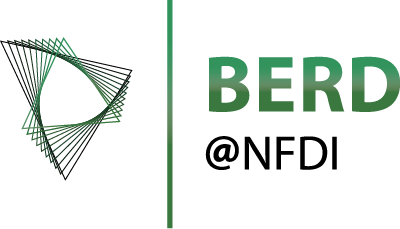

# PagePlus


PagePlus is a Python-based tool for processing and analyzing PAGE XML files, which are commonly used in document layout analysis. This tool provides a variety of functions to modify and extract data from these files, providing an efficient way to handle text and region-based information in document images. It offers both a command-line interface (CLI) for batch processing and a graphical user interface (GUI) for interactive use.

The project is generously funded by the [German Research Foundation (DFG)](https://www.dfg.de/foerderung/info_wissenschaft/2020/info_wissenschaft_20_15/index.html), [BERD@NFDI](https://www.berd-nfdi.de/), and the [Heidelberger Akademie der Wissenschaften (HAdW)](https://www.hadw-bw.de/).

## Table of Contents

- [Features](#features)
- [Installation](#installation)
- [Usage](#usage)
  - [GUI](#gui-usage)
  - [CLI](#cli-usage)
- [CLI Commands](#cli-commands)
- [Contributing](#contributing)
- [License](#license)
- [Funding](#funding)

## Features

PagePlus includes several commands to perform operations such as:

-   **Analytics**: Gathers detailed statistics about the contents of PAGE XML files, including counts of text regions, table regions, lines of text, words, and glyphs.
-   **Validation**: Ensures the integrity of text regions and lines in PAGE XML files, checking for and reporting any inconsistencies or errors.
-   **Modification**: A rich set of functions to repair, refactor, and modify PAGE XML files, including region manipulation, text line adjustments, and coordinate fixes.
-   **Export**: Extracts data from PAGE XML to various formats like plain text, PDF, ALTO XML, and delimiter-separated values (CSV/TSV).
-   **OCR Integration**: Tools for working with OCR engines like Kraken and Tesseract.
-   **LLM Integration**: Features leveraging large language models like Gemini for advanced document processing tasks.
-   **Workspace Management**: Utilities for managing project workspaces.

## Installation

To install PagePlus, you will need Python 3.11+ and [Poetry](https://python-poetry.org/) installed on your system.

1.  Clone the repository:
    ```sh
    git clone https://github.com/your-username/pageplus.git
    cd pageplus
    ```

2.  Install the required dependencies using Poetry. For GUI support, you need to install the `gui` extras:
    ```sh
    # For CLI only
    poetry install

    # For CLI and GUI
    poetry install --extras gui
    ```

3.  Activate the virtual environment created by Poetry:
    ```sh
    poetry shell
    ```
4. For WSL-User: In order to use the file picker in the GUI you need to install `wslu`.
   ```sh
   sudo add-apt-repository ppa:wslutilities/wslu
   sudo apt update
   sudo apt install wslu
   ```

## Usage

PagePlus can be used via its Graphical User Interface (GUI) or Command-Line Interface (CLI).

### GUI Usage

To start the GUI, run the following command from the root directory of the project:

```sh
pageplus-gui
```

This will open the PagePlus GUI in your web browser, where you can interactively load, process, and analyze your PAGE XML files.

### CLI Usage

PagePlus can be executed from the command line for batch processing and scripting.

The general syntax for using PagePlus CLI is:

```sh
pageplus [MODULE] [COMMAND] [ARGUMENTS] [OPTIONS]
```

Use the `--help` flag with any command to see all available options:

```sh
pageplus --help
pageplus modification --help
pageplus modification sort-regions --help
```

## CLI Commands

Here is a list of available commands, grouped by module:

-   **`analytics`**: `statistics`, `confidences`, `compare`, `tags`
-   **`dinglehopper`**: OCR evaluation metrics and comparison tools.
-   **`escriptorium` / `transkribus`**: Commands for interacting with transcription platforms.
-   **`export`**: `alto`, `dsv`, `fulltext`, `page-pdf`, and more.
-   **`gemini` / `litellm`**: Integrations with large language models.
-   **`ingest`**: Commands for importing and processing various file formats.
-   **`kraken` / `tesseract`**: Commands for performing OCR.
-   **`mets`**: Tools for working with METS files.
-   **`modification`**: `sort-regions`, `repair`, `extend-lines`, `reassign-ids`, `delete-text`, and many more.
-   **`projects`**: Commands for managing PagePlus projects.
-   **`system`**: System-related commands and utilities.
-   **`validation`**: Validates the structure and content of PAGE XML files.
-   **`workspace`**: Commands for managing workspaces.

## Contributing

Contributions to PagePlus are welcome! If you find a bug or have a feature request, please open an issue on the project's GitHub repository.

## License

This project is licensed under the MIT License. See the [LICENSE.txt](LICENSE.txt) file for details.

## Funding

PagePlus was initially created during the 3rd funding phase of the [OCR-D project](https://ocr-d.de/en/).

PagePlus is generously funded by the following organizations:

| DFG | BERD@NFDI | HAdW |
| :---: | :---: | :---: |
|  |  |  |  