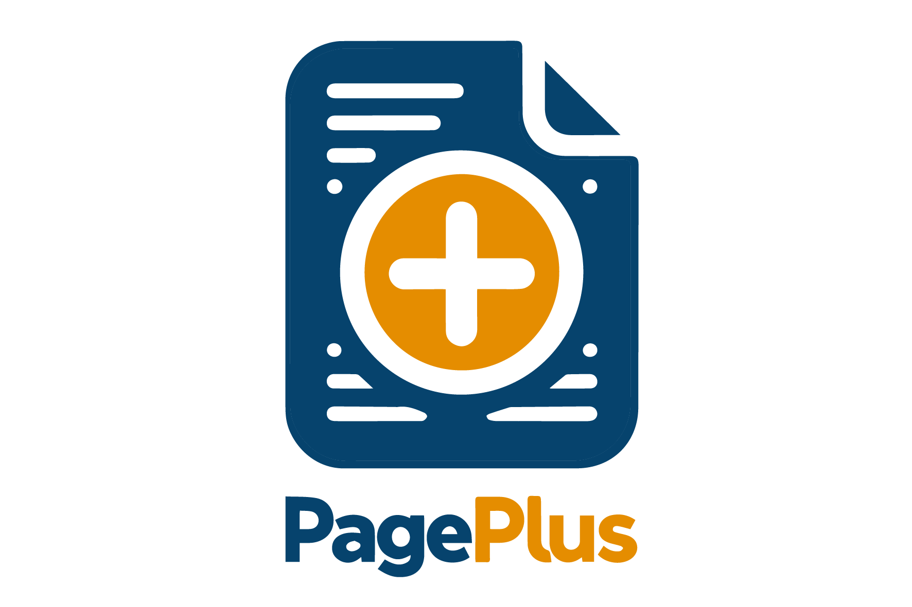

# PagePlus

PagePlus is a Python-based command-line tool for processing and analyzing PAGE XML files, which are commonly used in document layout analysis. 
This tool provides a variety of functions to modify and extract data from these files, providing an efficient way to handle text and region-based information in document images.

## PagePlus Features

PagePlus includes several commands to perform operations such as

**Analytics**: Gathers detailed statistics about the contents of PAGE XML files, including counts of text regions, table regions, lines of text, words, and glyphs. This feature is essential for understanding the scope and size of processed documents.

**Validation**: Ensures the integrity of text regions and lines in PAGE XML files, checking for and reporting any inconsistencies or errors.

**Repair**: Includes a set of repair functions that can fix common problems in PAGE XML files. This functionality is essential for improving the usability of processed files.

**Extend regions, lines and baselines**: Buffers regions, lines and baselines.

**Translating regions, lines and baselines**: Translates regions, lines and baslines by an offset.

**Textline sorting and merging/splitting**: Sorts and merges text rows in PAGE XML files based on specified horizontal and vertical gap thresholds.

**Baseline and Textline modification**: Processes text lines to extend baselines, fit textline polygons into parent regions, and calculate pseudo textline polygons.

**Region and word-level text deletion**: Provides the ability to delete text at various hierarchical levels within PAGE XML files.

**Fulltext extraction**: Extracts all text from PAGE XML files, optionally delimiting lines, and saves the output as plain text files.
    
**DSV (Delimiter-Separated Value) extraction**: Creates delimiter-separated files (such as CSV or TSV) from PAGE XML files, including details such as line IDs, text content, region numbers, baseline coordinates, and dimensions.
    
## Installation

To install PagePlus, you will need Python and poetry installed on your system. Clone the repository or download the source code and run the following command in the root directory:

```sh
poetry install
```

## Usage

PagePlus can be executed from the command line. Here are some examples of how to use its features:

#### Start poetry shell

```sh
poetry shell
```

#### Analytics:

```sh
pageplus analytics statistics /path/to/xml/files
```
#### Validation:

```sh
pageplus validation validate-all /path/to/xml/files
```

#### Repair:

```sh
pageplus modification repair /path/to/xml/files
```

#### Extend lines:

```sh
pageplus modification extend-lines /path/to/xml/files
```

#### Pseudolinepolygon:

```sh
pageplus modification pseudolinepolygon /path/to/xml/files
```

#### Delete Text content on specific level (Region, Line, Word):

```sh
pageplus modification delete_text /path/to/xml/files
```

#### Fulltext extraction:

```sh
pageplus export fulltext /path/to/xml/files --outputdir /path/to/output
```
#### Delimiter-Separated Value Extraction:

```sh
pageplus export dsv  /path/to/xml/files --delimiter ',' --outputdir /path/to/output
```
## Configuration
Most of the commands in PagePlus offer configurable options such as Outputdir for specifying the output directory, and other parameters for customizing the file processing. Use the --help flag with any command to see all available options:

```sh
pageplus --help
```

## Contributing
Contributions to PagePlus are welcome! If you find a bug or have a feature request, please open an issue.